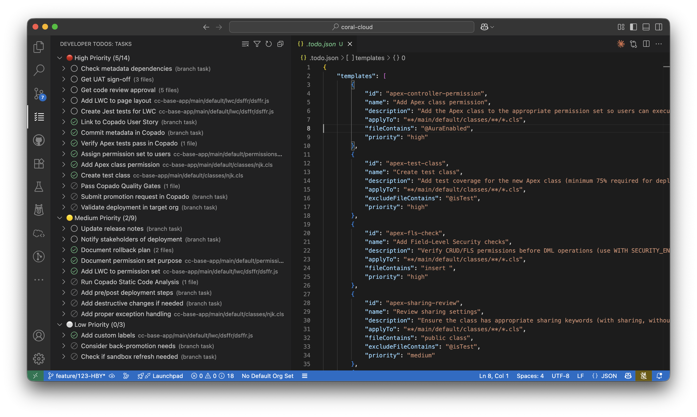
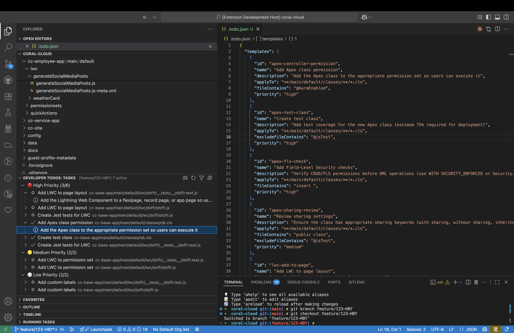
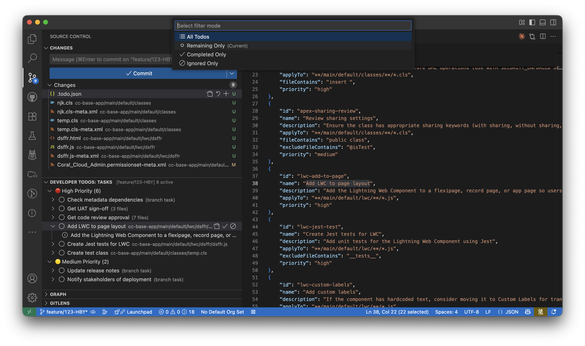
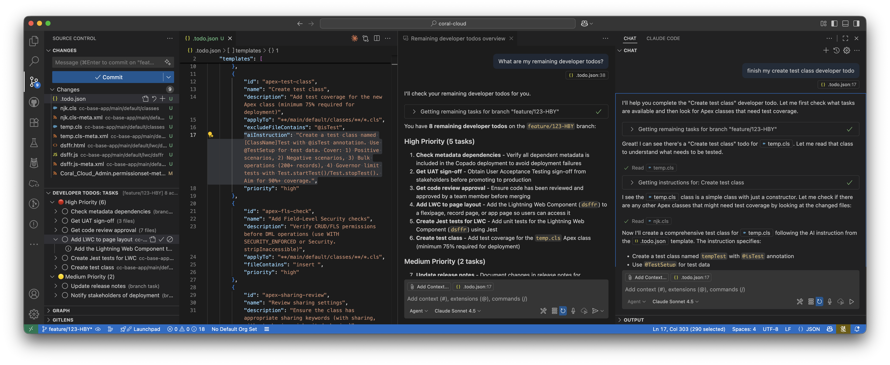

# Developer Todos

A beautiful VSCode extension that helps developers never forget common tasks when working on new features or bug fixes. Uses smart template matching to automatically create relevant todos based on file patterns and content.

## Features

- **Branch-Aware Todos**: Each git branch has its own todo list, keeping tasks isolated and organized
- **Smart Template Matching**: Automatically detects when files match your todo templates
- **Pattern & Content Matching**: Uses glob patterns and content checks to intelligently apply todos
- **Priority Organization**: Todos are grouped by priority (High, Medium, Low) for easy scanning
- **Persistent State**: Completed todos are remembered across VSCode sessions
- **AI Agent Compatible**: Exposes a clean API for AI agents to interact with your todos

## Screenshots


_Branch-aware todo list with priority grouping_


_Click to expand todos and see detailed descriptions_


_Filter between all/remaining todos and mark tasks complete_


_Ask Copilot about your tasks and get AI-powered assistance to complete them_

## Perfect for Salesforce Development

This extension was originally designed with Salesforce developers in mind, but works for any development workflow. Never forget to:

- Add permissions for new Apex controllers
- Create test classes for new classes
- Add LWC components to pages
- Assign permission sets to groups
- And much more!

## Installation

Install from the [VSCode Marketplace](https://marketplace.visualstudio.com/items?itemName=yourpublisher.developer-todos) or search for "Developer Todos" in VSCode Extensions.

### Development Installation

1. Clone this repository
2. Run `npm install`
3. Run `npm run compile`
4. Press F5 to open a new VSCode window with the extension loaded

## Quick Start with Examples

The fastest way to get started is using one of our ready-made templates. Download directly from GitHub:

| Template                | Best For                               | Download                                                                                                                |
| ----------------------- | -------------------------------------- | ----------------------------------------------------------------------------------------------------------------------- |
| **Salesforce**          | Apex, LWC, Flows, Triggers             | [Download](https://raw.githubusercontent.com/FredrikBurlin/developer-todos/main/examples/salesforce-todo.json)          |
| **General Development** | JavaScript, TypeScript, React, Node.js | [Download](https://raw.githubusercontent.com/FredrikBurlin/developer-todos/main/examples/general-development-todo.json) |
| **Simple Starter**      | Learning the extension                 | [Download](https://raw.githubusercontent.com/FredrikBurlin/developer-todos/main/examples/simple-starter-todo.json)      |
| **Python/Django**       | Python, Django, Flask, FastAPI         | [Download](https://raw.githubusercontent.com/FredrikBurlin/developer-todos/main/examples/python-todo.json)              |
| **Go**                  | Go/Golang projects                     | [Download](https://raw.githubusercontent.com/FredrikBurlin/developer-todos/main/examples/go-todo.json)                  |
| **Rust**                | Rust projects                          | [Download](https://raw.githubusercontent.com/FredrikBurlin/developer-todos/main/examples/rust-todo.json)                |
| **Java/Spring**         | Java, Spring Boot, Maven               | [Download](https://raw.githubusercontent.com/FredrikBurlin/developer-todos/main/examples/java-todo.json)                |
| **C#/.NET**             | C#, .NET, ASP.NET Core                 | [Download](https://raw.githubusercontent.com/FredrikBurlin/developer-todos/main/examples/csharp-todo.json)              |

### Quick Install (using curl):

```bash
# Salesforce
curl -o .todo.json https://raw.githubusercontent.com/FredrikBurlin/developer-todos/main/examples/salesforce-todo.json

# General Development (JS/TS/React)
curl -o .todo.json https://raw.githubusercontent.com/FredrikBurlin/developer-todos/main/examples/general-development-todo.json

# Python/Django
curl -o .todo.json https://raw.githubusercontent.com/FredrikBurlin/developer-todos/main/examples/python-todo.json

# Go
curl -o .todo.json https://raw.githubusercontent.com/FredrikBurlin/developer-todos/main/examples/go-todo.json

# Rust
curl -o .todo.json https://raw.githubusercontent.com/FredrikBurlin/developer-todos/main/examples/rust-todo.json

# Java/Spring
curl -o .todo.json https://raw.githubusercontent.com/FredrikBurlin/developer-todos/main/examples/java-todo.json

# C#/.NET
curl -o .todo.json https://raw.githubusercontent.com/FredrikBurlin/developer-todos/main/examples/csharp-todo.json
```

**See all examples:** Check the [examples folder on GitHub](https://github.com/FredrikBurlin/developer-todos/tree/main/examples) for more templates and customization guides.

---

## Getting Started

### 1. Create a `.todo.json` file in your workspace root

**Option A: Use an example template** (recommended for first time)

Copy one of the [example templates](examples/) to your workspace root and rename it to `.todo.json`.

**Option B: Create your own**

```json
{
  "templates": [
    {
      "id": "apex-permission",
      "name": "Add Permission for the controller",
      "description": "User needs permission to use the apex controller",
      "applyTo": "force-app/main/default/classes/**/*.cls",
      "fileContains": "@AuraEnabled",
      "priority": "high"
    },
    {
      "id": "lwc-add-to-page",
      "name": "Add LWC on a page",
      "description": "The LWC needs to be added to a flexipage or similar to show up for the user",
      "applyTo": "force-app/main/default/lwc/**",
      "priority": "medium"
    },
    {
      "id": "apex-test-class",
      "name": "Create test class",
      "description": "Add test coverage for the new Apex class",
      "applyTo": "force-app/main/default/classes/**/*.cls",
      "fileContains": "public class",
      "excludeFileContains": "@isTest",
      "priority": "high"
    }
  ]
}
```

### 2. View your todos in the Activity Bar

Click on the "Developer Todos" icon in the activity bar to see your todo list.

### 3. Start coding!

As you create or modify files that match your templates, todos will automatically appear in the sidebar.

## Template Configuration

Each template supports the following properties:

- **id** (required): Unique identifier for the template
- **name** (required): Display name shown in the todo list
- **description** (required): Detailed description of what needs to be done
- **applyTo** (optional): Glob pattern to match file paths (e.g., `**/*.cls`, `src/**/*.ts`). Not needed for branch-level todos.
- **fileContains** (optional): String that must be present in the file content
- **excludeFileContains** (optional): String that must NOT be present in the file content
- **priority** (optional): Priority level (`high`, `medium`, or `low`). Defaults to `medium`.
- **branchLevel** (optional): Set to `true` for todos that apply once per branch (not tied to files).
- **aiInstruction** (optional): Detailed instructions for AI assistants on how to complete the task.

### Example Templates

#### Salesforce: Apex Controller Permission

```json
{
  "id": "apex-permission",
  "name": "Add Permission for the controller",
  "description": "User needs permission to use the apex controller",
  "applyTo": "force-app/main/default/classes/**/*.cls",
  "fileContains": "@AuraEnabled",
  "priority": "high"
}
```

#### Salesforce: Test Class Required

```json
{
  "id": "apex-test-class",
  "name": "Create test class",
  "description": "Add test coverage for the new Apex class",
  "applyTo": "force-app/main/default/classes/**/*.cls",
  "fileContains": "public class",
  "excludeFileContains": "@isTest",
  "priority": "high"
}
```

#### React: Component Testing

```json
{
  "id": "react-test",
  "name": "Add component tests",
  "description": "Create unit tests for this React component",
  "applyTo": "src/components/**/*.tsx",
  "excludeFileContains": ".test.",
  "priority": "high"
}
```

#### API: Add Documentation

```json
{
  "id": "api-docs",
  "name": "Document API endpoint",
  "description": "Add OpenAPI/Swagger documentation for this endpoint",
  "applyTo": "src/api/**/*.ts",
  "fileContains": "router.",
  "priority": "medium"
}
```

#### Branch-Level: Deployment Tasks

Branch-level todos appear once per branch and are not tied to specific files. Perfect for deployment tasks, release notes, or any task that needs to be done once before merging.

```json
{
  "id": "deployment-checklist",
  "name": "Review deployment checklist",
  "description": "Verify all deployment requirements are met: tests pass, documentation updated, stakeholder approval",
  "branchLevel": true,
  "priority": "high"
}
```

```json
{
  "id": "notify-team",
  "name": "Notify team of changes",
  "description": "Send a message to Slack/Teams about the upcoming changes and any impacts",
  "branchLevel": true,
  "priority": "medium"
}
```

## Commands

- **Refresh Todos**: Manually scan workspace for todos
- **Complete Todo**: Mark a todo as complete (click checkmark icon)
- **Open File**: Click on a todo to open the associated file
- **Show Template Details**: View full template information
- **Clear Branch Todos**: Remove all todos for the current branch

## Branch Workflow

Developer Todos is designed around a branch-based workflow:

1. Create a new feature branch: `git checkout -b feature/new-auth`
2. Start coding - todos appear automatically
3. Complete todos as you work
4. Switch branches - each branch maintains its own todo list
5. Your completed todos persist across VSCode restarts

## AI Integration

### Language Model Tools (GitHub Copilot, etc.)

The extension provides native AI integration through VS Code's Language Model Tools API. These tools are automatically available to AI assistants like GitHub Copilot:

| Tool | Reference | Description |
|------|-----------|-------------|
| **Get Remaining Tasks** | `#devTodos` | Lists all incomplete tasks for the current branch |
| **Complete Task** | `#completeTodo` | Marks a specific task as completed |
| **Get Task Instructions** | `#taskInstructions` | Gets detailed AI instructions for a task |

#### Example Prompts with Copilot

- "What tasks do I need to complete? #devTodos"
- "Show me the high priority tasks #devTodos"
- "How do I complete this test class task? #taskInstructions"
- "Mark the apex-permission task as done #completeTodo"

### AI Instructions (`aiInstruction`)

Templates can include an `aiInstruction` field that provides detailed guidance for AI assistants:

```json
{
  "id": "apex-test-class",
  "name": "Create test class",
  "description": "Add test coverage for the new Apex class",
  "applyTo": "**/classes/**/*.cls",
  "priority": "high",
  "aiInstruction": "Create a test class with @isTest annotation. Include test methods for all public methods. Use Test.startTest()/Test.stopTest() for governor limits. Aim for 90%+ coverage."
}
```

When an AI assistant queries task instructions, it receives this detailed guidance along with the task details.

See the [AI Agent Guide](AI_AGENT_GUIDE.md) for comprehensive documentation.

## Tips

- **Start simple**: Begin with 2-3 high-impact templates and expand as needed
- **Be specific**: Use both `applyTo` and `fileContains` for precise matching
- **Prioritize wisely**: Use `high` priority for tasks that affect functionality
- **Review regularly**: Use the "Refresh Todos" command after major changes
- **Customize patterns**: Adjust glob patterns to match your project structure

## Non-Git Workspaces

If you're not using Git, the extension will still work! Todos will be organized under a "default" branch.

## Requirements

- VSCode 1.93.0 or higher (for AI tools integration)
- Node.js (for development)

## Development

### Build

```bash
npm install
npm run compile
```

### Watch Mode

```bash
npm run watch
```

### Package

```bash
npm run vscode:prepublish
```

## Contributing

Contributions are welcome! Please feel free to submit issues or pull requests.

## License

MIT

## Credits

Built with love for developers who want to maintain high code quality without the mental overhead of remembering every little task.
